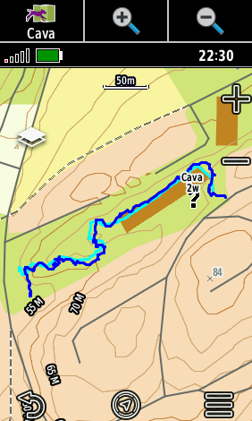
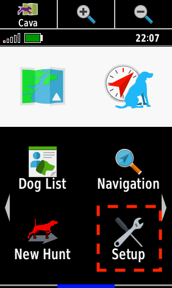
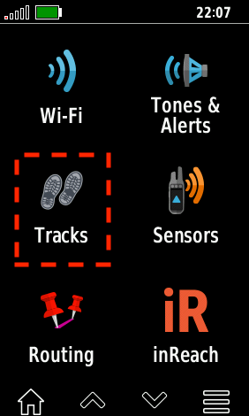
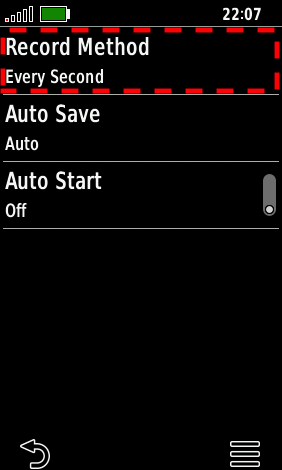
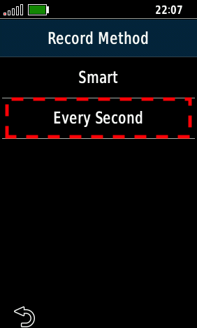
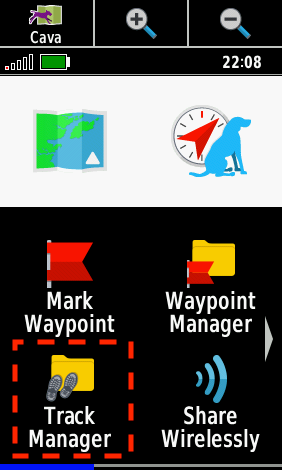
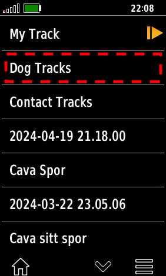
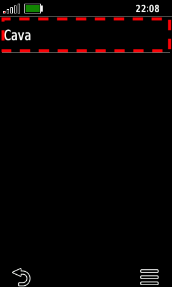
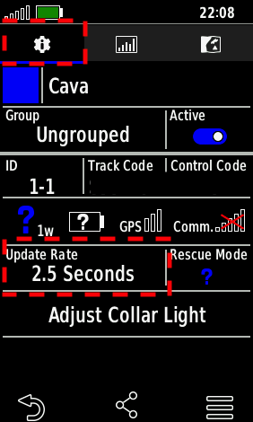
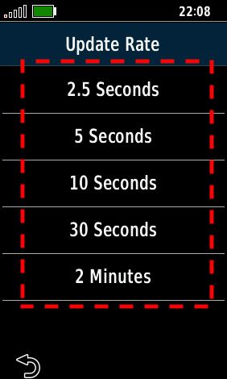

# Gå et spor med GPS

Lei av at GPS-sporet er unøyaktig, og inneholder for lite detaljer? Når du legger et spor til deg selv, eller noen andre, kan det noen ganger være kjekt å kunne se nøyaktig hvor sporet går. Om du skal kontrollere deg selv, eller sammenligne med sporet hunden har gått.

## Spor på Garmin Alpha - "problemet"

Vi tar for oss hovedsakelig Garmin Alpha GPS-er, men det er tilsvarende funksjonalitet på andre enheter også.

Hvordan sporene registreres er som standard satt til å være "**smart**". Da registrerer den nytt punkt kun når den merker en markant endring i retning, hastighet, eller høydemeter. Dette til fordel for strømforbruk og lagringsplass. Resultatet av slik registrering av punkter er at du får mindre nøyaktige spor da den kun lagrer et fåtall punkter over en strekning. Du vil se da at sporet du akkruat gikk vises i rette fine linjer gjennom terrenget, og inneholder ikke den mer detaljerte ruta "rundt den kenika", eller "forbi det treet".

Dette er fint om du feks. går tur eller jakt, og trenger å tracke noe over lengre tid. For trening og sporlegging til hunden er ikke dette helt ideelt, men det finnes en løsning!

## Spor med hund + Garmin Alpha

Det er kanskje ønskelig å få med retningsendringer, buer, og andre detaljer når en _går spor_. Dette kan løses ved å be GPS-en registrere punkter oftere, og ikke med denne "smart"-funksjonen den har. Det vil trekke mer strøm av GPS-en, og ta mer lagringsplass (ikke kritisk om en er flink til å fjerne gamle spor fra GPS-en).

**Eksempel på hvordan mer nøyaktig GPS-plotting kan se ut med hund:**

Nedenfor ser du framgangsmåten for å gjøre det på en Garmin Alpha GPS. Det er nok tilsvarende funksjon på andre GPS-er.

### 1. Fra hovedmenyen

- Velg så innstillinger
- Deretter **Spor**

### 2. Fra spormenyen

- Her finner du _"Record Method"_ - velg den.
- Velg deretter at den skal registrere _hvert sekund_.

Når denne er satt vil GPS-en nå registrere et punkt hvert sekund, og dermed også få med seg enda flere detaljer i sporet du går.

## Hva med hunden, og hundehalsbådet?

Det samme gjelder for hundehalsbåndet. Den kan også stilles til å registrere mer detaljert spor. Dette gjør du ved å først skru den på, og vente til den er tilkoblet GPS-en (mulig du må være ute der det er GPS-dekning før de vil koble seg sammen).

### 1. Fra hovedmenyen -

- Velg _"Track Manager"_.
- Deretter velg _"hundespor"_.
- Velg så aktuell hund/hundehalsbånd.

### 2. Inne i hundens meny

- Velg tannhjulet i menylinjen øverst.
- Deretter ser du "oppdateringsrate"-valget lengre ned. Velg denne.

Her kan du sette på forskjellige intervaller. For mer nøyaktig sporing velg det laveste. I dette tilfellet er det 2.5 sekunder.

---

Med GPS og hundehalsbånd stilt inn til å registrere punkter oftere vil du nå få et mer detaljert spor. God sportrening!
